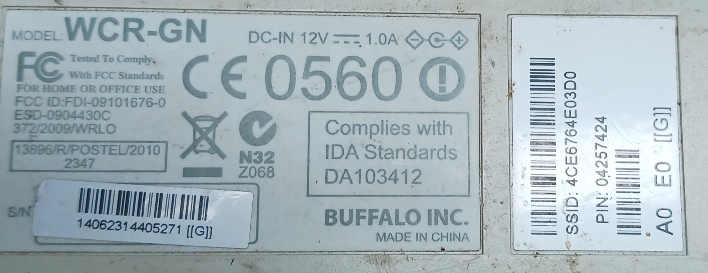
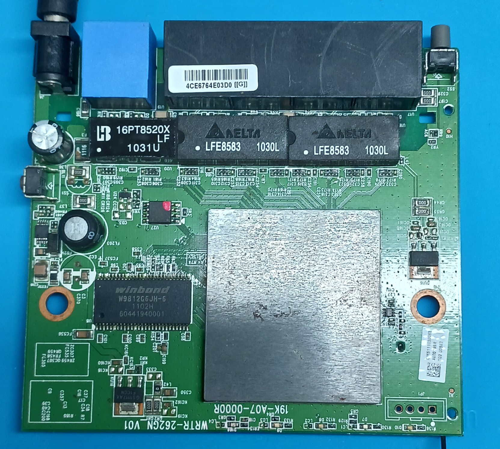
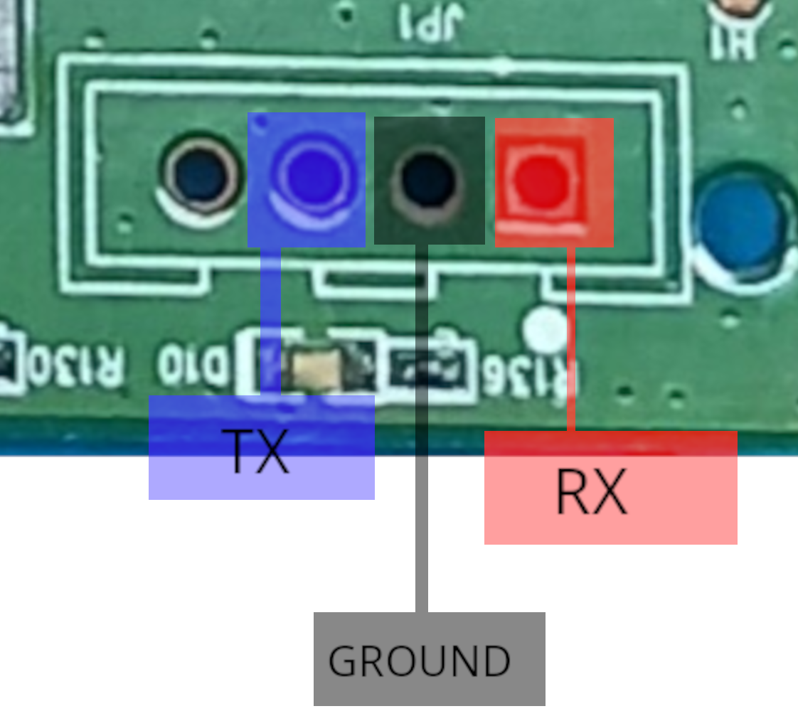

# BUFFALO ROUTER (WCR-GN)
---
### Images 
---
 <br>
 <br>
 <br>
### Serial Readings
---
Read 1 <br>
<br>
```
 DRAM:  16 MB

relocate_code Pointer at: 80fb4000

S IS ASIC
Linux version 2.6.21 (jason@Con disabled
cause = 10800060, status = 1100ff00
PID hash table24 (order: 0, 4096 bytes)
Memory: 13760k/16384k available (2011ed (default)
Ralink gpio driver initialized
6
N_HDLC line discipline registered.
Ralink APSoC Hardware Wat
mtd .name = raspi, .size = 0x00400000 (4M) .erasesize = 0x0001gistered protocol family 1
NET: Registered protocol family 17
MIPS FPU Emulator v1.5
h bogus options
none on /sys failed: No such device
mount: mou__| ||  |__| ||   |__  __ |     \| || |/  /
    |   _   /|   _  3100
nvram_init: INFO=>nvram MAC initialized succesADRH -- : 0x00004ce6
GDMA1_MAC_ADRL -- : 0x764e03d0
switch reg write offset=14, value=405555
switch reg write o) entering forwarding state
rt2860v2_ap: module l3

-------------------------------------------- 

ASIC 3052_MP2 e Name:   Linux Kernel Image

   Created:      2010-12-13   6:41OK

No initrd

## Transferring control to Linux (at address 8023a000) ...

## Giving linux U revision is: 0001964c
Determined physical RAM map:
 memory:  TLB modify handler fastpath (31 instructions).
Cache parity pr (2011k kernel code, 2624k reserved, 264k data, 108k init, 0k hitered
Load Ralink DFS Timer ModD) (SUMMARY)  (C) 2001-2006 Red Hat, Inc.
io scheduler noop reg) is a 16550A
loop: loaded (max 8 devices)
rdm_major = 254
PP0000 (64K) .numeraseregions = 0
Creating 6 MTD partitions on "r0.5.0 (128 buckets, 1024 max)
ip_tables: (C) 2000-2006 Netfilte000c
GDMA1_MAC_ADRL -- : 0x43305277
PROC INIT OK!
VFS: Mounted root (squashfs filesystem) omiscuous mode
device vlan0001 entered promiscuous mode
Ma
.1 (2010-12-13 14:28:34 CST) built-in shell (ash)
Enter 'help' 
```
Read 2 <br>
<br>
```
Board: Ralink APSoC DRAM:  16 MB
relocate_code Pointer at: 80fb4000
squashfs: version 3.2-r2 (2007/01/15) Phillip Lougher
squashfs: LZMA suppport for slax.org by jro
JFFS2 version 2.2. (NAND) (SSet: phy[0].reg[0] = 3100
Set: phy[1].reg[0] = 3100
vlan0001: Setting MAC address to  4c e6 76 4e 03 d0.
VLAN (vlan0001):  Underlying device (eth2) has same MAC, not checking promrt2860v2_ap: module license 'unspecified' taints kernel.
<-- RTMPAllocTxRxRingMemory, Status=0
Main bssid = 4c:e6:76:4e:03:d0
<==== rt28xx_init, Status=0
0x1300 = 00064380
device ra4 entered prdevice ra0 entered pro1900
ipv6_passt/dnsmasq.sh start ok
 system code to SDRAM via TFTP. 
   2: Load system code then write to Flash via TFTP. 
init started: BusyBox v1.12.1 (2010-12-13 14:28:34 CST)
  4c e6 76 4e 03 d0.
VLAN (vlan0002):  Underlying device (eth2) has same MAC, not checking promiscious mode.
RX D1

U-Boot 1.1.3 (Sep 30 2009 - 21:47:05)

Board: Ralink APSoC DRAM:  16 MB
relocate_code Pointer at: 80fb4000
NET: Registered protocol family 16
NET: Registered protocol family 2
Time: MIPS clocksource has been installed.
HDLC line discipline: version $Revision: 1.1.1.1 $, maxframe=4096
N_HDLC line discipline registered.
Ralink APSoC Hardware WatSet: phy[0].reg[0] = 3100
Set: phy[1].reg[0] = 3100
Set: phy[2].reg[0] = 3100
Set: phy[3].reg[0] = 3100
Set: phy[4].reg[0] =GDMA1_MAC_ADRH -- : 0x00004ce6
GDMA1_MAC_ADRL -- : 0x764e03d0
rite offset=40, value=1001
switch reg write offset=44, value=1001
switch reg write offset=48, value=1002
switch reg write offvlan0001: Setting MAC address to  4c e6 76 4e 03 d0.
VLAN (vlan0001):  Underlying device (eth2) has same MAC, not checking promipv6_passthru_disable


U-Boot 1.1.3 (Sep 30 2009 - 21:47:05)

Board: Ralink APSoC DRAM:  16 MB
relocate_code Pointer at: 80fb4000
*** Warning - bad CRC, using default environment

=========12
NET: Registered protocol family 16
NET: Registered protocol family 2
Time: MIPS clocksource has been installed.
 phy[0].reg[0] = 3100
Set: phy[1].reg[0] = 3100
Set: phy[2].reg[0] = 3100
Set: phy[3].reg[0] = 3100
Set: phy[4].reg[0] = 310vlan0001: Setting MAC address to  4c e6 76 4e 03 d0.
VLAN (vlan0001):  Underlying device (eth2) has same MAC, not checking promFri Jan  1 00:00:00 GMT 2010
br0: topology change detected, propagating
br0: port 1(vlan0001) entering forwarding state
rt2860v2_ap: module license 'unspecified' taints kernel.
ssid = 4c:e6:76:4e:03:d0
<==== rt28xx_init, Status=0
0x1300 = 00064380
ort 3(ra0) entering learning state
brctl setwlanforward br0 15
/usr/shell/dnsmasq.sh start ok
dnsmasq: usingassProduct: Use IF(br0) IP(192.168.11.1)
/usr/sbin/massProduct: Use IF(br0) IP(192.168.11.1):14675
starting pid 774, tty '/dev/ttyS1': '/bIP route cach0: started
block2mtd: version $Revision: 1.1.1.1 $
deice id : c2 20 16 c2 20 (2016c220)
mx25l3205d(c2 20160000) (4096 Kbytes)GDMA1_MACvlan0002: Setting MAC address to  4c e6 76 4e 03 d0.
VLAN (vlan0002):  Underlying device (eth2) has same MAC, not checking promiscious mode.
Started WatchDog Timer.
br0: topology change detected, propagating
br0: port 1(vlan0001) entering forwarding state
RX DESC a0b39000  size = 2048
brctl setwlanforward br0 15
br0: topology change detected, propagating
br0: port 2(ra4) entering forwarding state
stompilerServer.gemtek.com.tw) (gcc version 3.4.2) #561 Mon Dec 13 14:40:42 CST 2010

 The CPU feqenuce set to 320 MHz
CPU revisized TLB load handler fastpath (32 instructions).
Synthesized TLB store handler fastpath (32 instructions).
Synthesized TLB m24 (order: 0, 4096 bytes)
Memory: 13760k/16384k available (2011k kernel code, 2624k reserved, 264k data, 108k init, 0k highmem) hash table entries: 512 (order: -1, 2048 bytes)
TCP: Hash tables configured (established 512 bind 512)
TCP reno registered
Lsquashfs: version 3.2-r2 (2007/01/15) Phillip Lougher
squashfs: LZMA suppport for slax.org by jro
JFFS2 version 2.2. (NAND) (Snvram_init: INFO=> RC.CONF successful created!
vlan0002: Setting MAC address to br0: port 1(vlan0001) entering learning state
br0: topology change detected, propagating
br0: port 1(vlan0001) entering forwarding state
promiscuous mode
br0: port 3(ra0) entering learning state
ng
br0: port 3(ra0) entering forwarding state

```