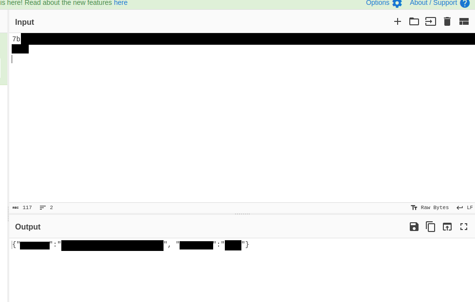
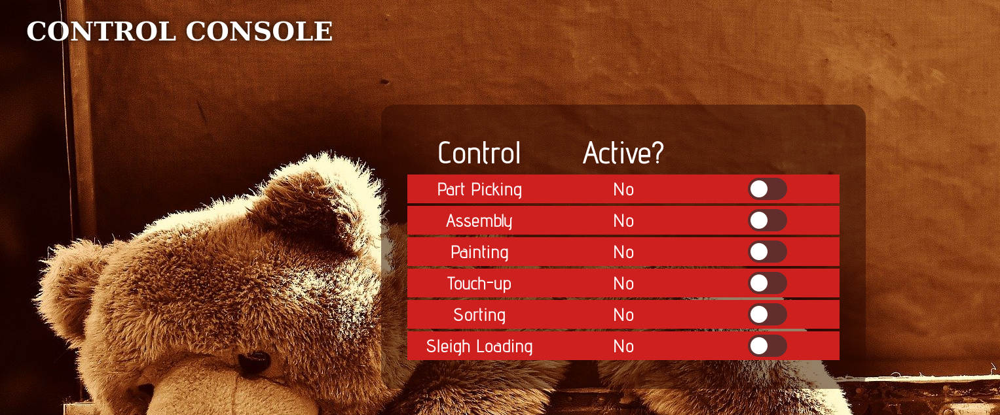
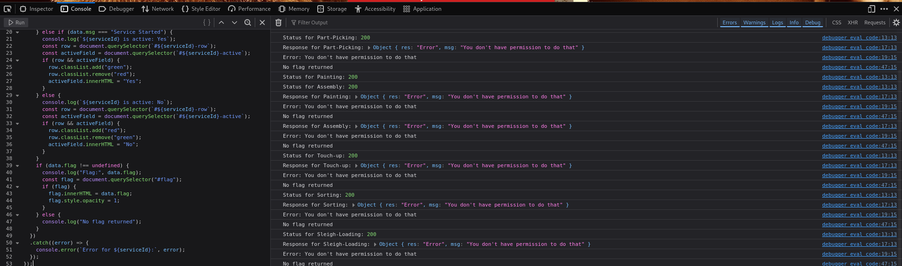
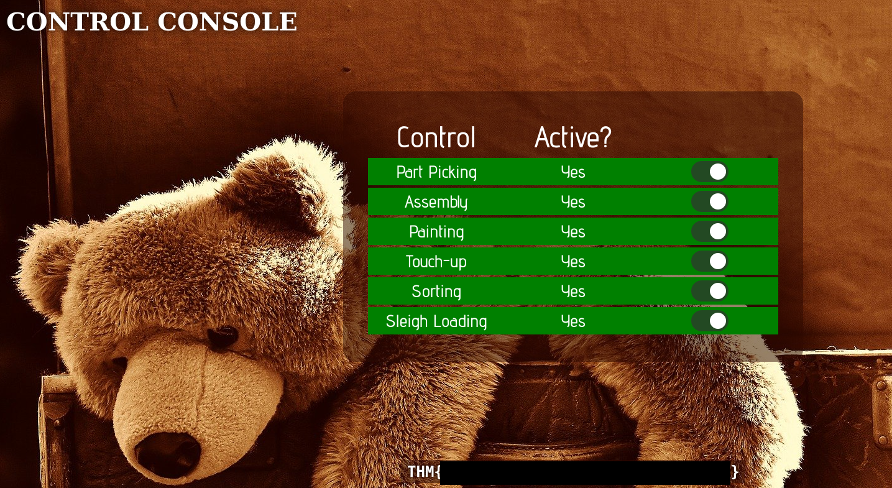

# Santa's Work Shop (25 Days of Cyber Security)
---
### Introduction
So the first activity or hacktivity revolves around web exploits mostly. The first few introductory challenges were mostly about how websites work, from HTML, CSS, and JavaScript to their protocols like HTTPS and HTTP. But the integral part was a website’s cookies, specifically exploiting cookies.
One challenge is that Santa's workshop is not running. I think I need to create an account and obtain admin privileges to start Santa's workshop.
### Findings
---
After creating an account and accessing the so-called workshop page, I decided to look for anything suspicious or any possible ways to exploit it. I used the hints in the rooms and found everything I needed, but these clues are only useful if you know what you're supposed to do. 
- Cookies are encoded in Hexadecimal 
- The name for the authentication value is auth.
After finding the cookie I decided to decode them.

### Exploit
---
So I need to turn on all of the options in order for it work.

I scanned through the HTML and found a small class called `flag` hidden between rows of tables. Then, I tried using a JavaScript exploit to gain administrator privileges and activate them all. I had noticed in the site's JavaScript that administrator privileges were required to do this, so I thought it might work through an exploit. Unfortunately, it didn't.

Obviously, it didn't work at first, but then I remembered that the challenge was about exploiting the cookie and its values. I used the hint, and guess what—it worked! All I had to do was read the hint and change a certain value in the cookie.
