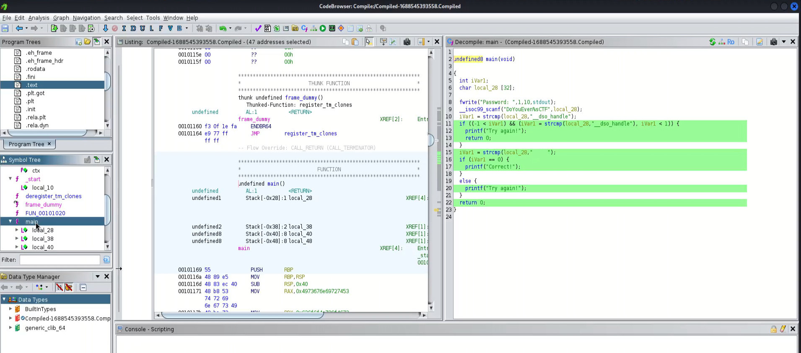

# The Compiled THM 
---
### Intro
First of all, I didn't have any prior knowledge of this. Everything I've been doing so far has been based on watching tutorials, reading Stack Overflow, and, to some extent, using ChatGPT.
### Running 
After downloading 'Compiled-1688545393558.Compiled', I immediately had to guess how to view it, since I had no idea what to do at first. I had never seen a compiled binary from any C-like language before.

Since I don’t have much knowledge about decompiling, I decided to rename the file to `.c` or `.cpp`, hoping that it might reveal the source code. I was wrong—and in hindsight, that was a pretty naive move to begin with.
### Trying to read it
Then I looked at the hints and realized that I needed to follow the logic. But how am I supposed to read the code when it’s just a mess of random characters and doesn’t resemble the source code at all?
After looking at it, I found my first few clues—namely, 'StringISForNoobs' and 'DoYouEvenCTF'. I wasn’t sure if those were the complete phrases or just partial hints.

So, I decided to try out some possible passwords that I came up with.
- DoYouEvenNoobCTF
- DoYouEven_StringIsForNoobsCTF
- DoYouEven_CTF
All did not work.
### Decompiling and learning how C or C++ code works
So I decided to use Ghidra, as it was recommended by many people—even on Stack Overflow and ChatGPT. I downloaded it and ran it. The source code was displayed, and although I had no prior knowledge of C or C++, I did understand what if-statements were.

So, I think I learned that `strcmp()` is a function that compares two strings — or maybe variables containing strings. Since my first language was Java, I expected it to be easier, like just using a variable from a Scanner class and then comparing it directly. But that’s not how it works. `strcmp()` isn’t like Java’s Scanner; instead, it compares strings that are already provided. I now understand that `strcmp()` works more like this: `strcmp("user input", "expected value")`. So the actual password would be something like `DoYouEven_(...)`.
