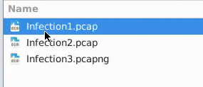
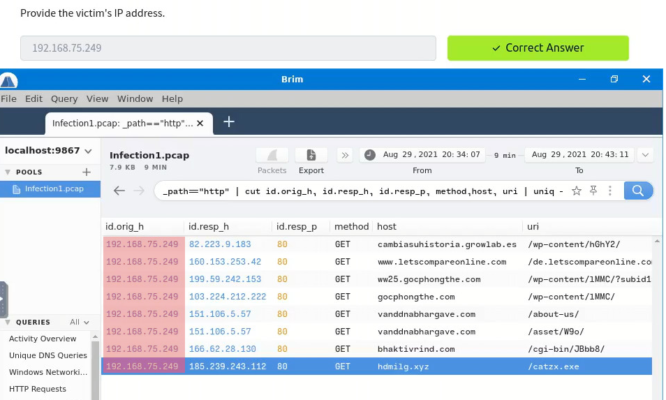
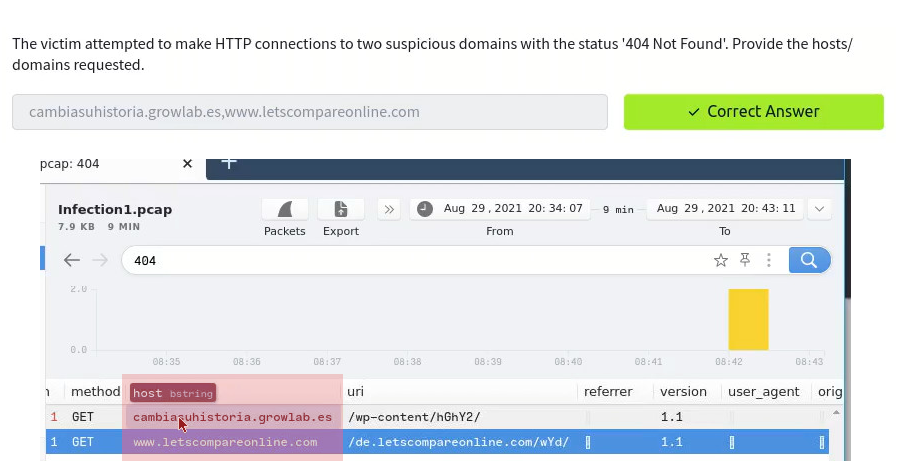
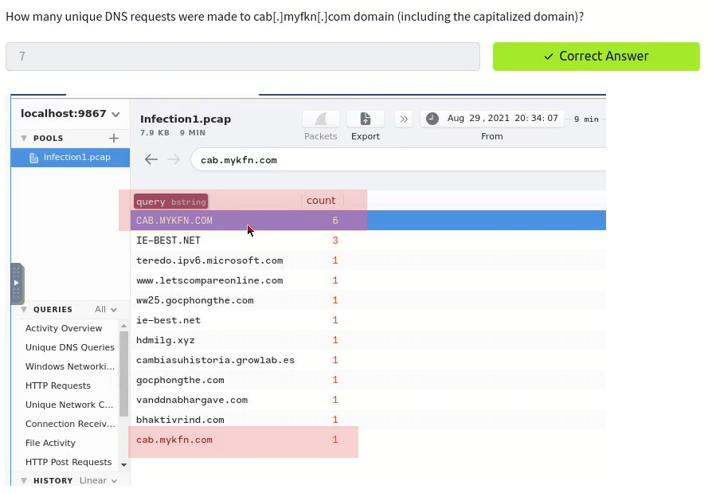
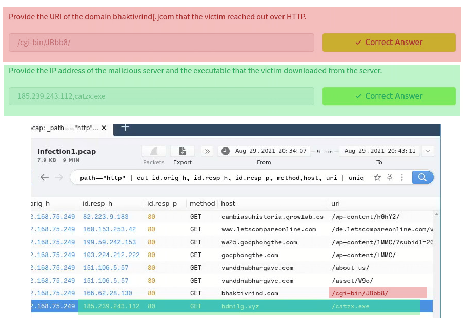
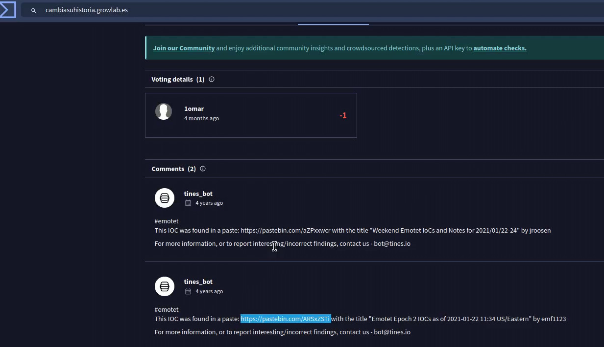

# Try Hack Me Masterminds
---
### Introduction 
This room is primarily focused on analyzing PCAP files for malicious traffic using Brim. It is somewhat similar to Wireshark.  
You are given three separate capture files: _Infection 1_ and _Infection 2_ are in PCAP format, while _Infection 3_ is in PCAPNG format.

### Challenge 1
---
Find the IP Address.  
 
Find two suspicious that made a HTTP request that end up having a 404.  
 
Find the unique DNS request and make sure you include all forms of (ALL CAPS or Lower Space). 
 
Find the URI domain bhaktivrind[.]com that the victim reached out over HTTP. 
 
Find the executable and IP Address it had originated. 
 
Find the name of the malware. 
 